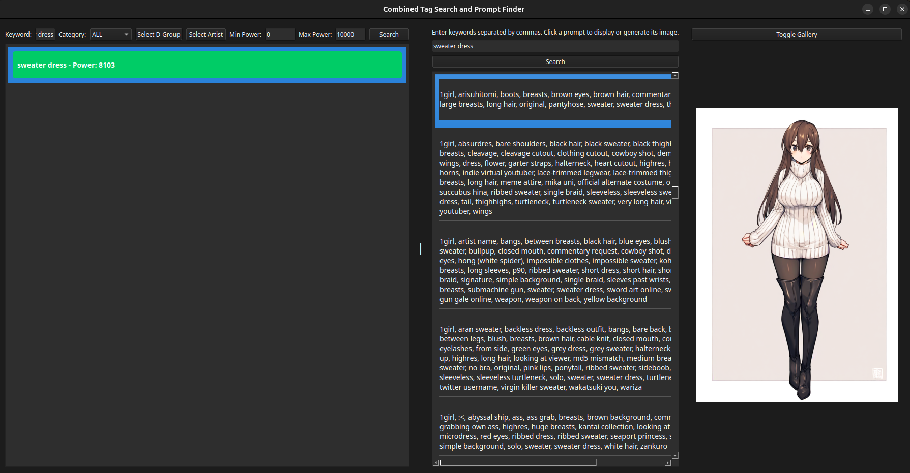

NovelAI Prompt Search and Image Gen
USE:
Watch exampleuse.webm for a quick visual overview.

This is an API-based application to search and find detailed prompts to utilize in NovelAI's image search, and to easily generate and organize those images into an easy to use gallery with a few easy clicks. You will need a persistent API key for NovelAI that you can get in your novelAI settings->Account. Click the button for "Get Persistent API Token" and you'll be able to add it when you load the app. It has an option to save your token if you don't want to input it every time you load the app.

This uses a massive corpus of prompts based on images and prompts that work with NovelAI's image gen. They are labeled by POWER, allowing you to see how much impact each keyword will likely have on your image (higher numbers = better impact).

All generated images go into the /images folder. I've set up some basic settings in the gen_image_nai.py that are fairly easy to understand if you want to open that file up in a code editor and make adjustments to your settings. Right now it's set up to produce quality portraits to my own liking based on my OPUS account, but you can easily fiddle with it as you like. I might include those settings in the front-end UI at some point in the future, but for now it's set up nicely by default and the images generated are extremely close to the original images tagged in the dataset.

### INSTALL AND RUN:
Extract the zip file into a folder of your choice.
In windows, run the windowsSTART.bat file (double click it), OR, go to the folder in the terminal and type python main.py
In Linux, go to this folder in the terminal and type ./START

USE:
Watch exampleuse.webm for a quick visual overview.

OVERVIEW OF THE APP:
This app will allow you to quickly search through a massive prompt library geared toward generating images on NovelAI. Once you find a prompt you like, you can generate it on the spot.

On first load it will ask for your API key. Get this persistent API key from your account settings in NovelAI. It has an option to SAVE your api key, but you don't have to save it if you don't mind inputting it every time you open the app.

LEFT PANE:
The left hand pane is for searching keywords. Type something in like "sweater dress" and it will pull up the sweater dress keyword. All of these search boxes are connected, so it is sometimes possible to select things that have NO prompts represented in the dataset. For example, if you search a specific artist, and type in a keyword like "cat", and the artist has never drawn anything with the word "cat" in it, you won't see any prompts. PLEASE REMEMBER THIS! In that instance, you'd want to set Artist back to ALL, then search cat again and you'll find cats.

The keyword will have a "power". Power is a measure of how strong that keyword is likely to be on NovelAI. Higher is better, lower is less likely to have a major effect. 10,000 power is maximum power.

The next dropdown is for Category. That lets you select from a set of categories to organize the keywords you've searched for things like characters, artists, etc. This just lets you drill down a bit.

The next button is Select D-Group. This lets you select a bunch of categories for various different things, like eyewear, leg wear, poses, etc. Again, remember if you select a d-group, you are carving down to a much smaller group of tags (for example, everything with "lenswear"). Make sure you set this back to ALL when you're done using it.

The next button is Select Artist. This shows a list of artist represented in NovelAI, along with how strongly they are likely to influence generation. Higher power artists are more likely to have unique and noticeably different images.

Next up is your Min and Max power search boxes. You can use these to find keywords within certain ranges.

MIDDLE PANE:
The central pane is where you'll find the prompts for keywords you're selecting. Any keywords you've left clicked on will be added to the prompt keyword list above the center. Remember, this will ONLY show you prompts that have ALL the keywords listed in the prompt box above. If it's not showing you anything, you need to remove some keywords! When you find a prompt you like, left click it and you can generate it! Once generated, images will be retained in a /images folder, and you can view them in the right pane in gallery or singular view. The goal here is to only generate a prompt once and not to generate it again.

RIGHT PANE:
The right pane is where images are displayed. It has a gallery and a regular view, and when you click on an image in gallery view, it shows you the prompt for that image.

CLEANUP:
Right now, apitoken.json will contain your API key (if you save it), and generated_images.json will have a full list of the prompts of every image you've generated. Once you find a prompt you really like, you can take it into NovelAI and adjust it any way you like.

DETAILED INSTALLATION FROM SCRATCH:
Cloning the NAI Prompt Tag Search and Gen Repository
Follow these steps to download the program to your computer using Git:

Install Git:
If you don't have Git installed, download and install it from git-scm.com.
Open a terminal or command prompt:

On Windows: Open "Command Prompt" or "Git Bash"
On macOS: Open "Terminal"
On Linux: Open your preferred terminal application

Navigate to the directory where you want to download the project:
cd path/to/your/preferred/directory

Replace path/to/your/preferred/directory with the actual path where you want the project folder to be created.

Clone the repository:
git clone https://github.com/Deveraux-Parker/NAI-Prompt-Tag-Search-and-Gen.git

This command creates a new folder named NAI-Prompt-Tag-Search-and-Gen containing the project files.

cd NAI-Prompt-Tag-Search-and-Gen

Verify the contents:
List the contents of the directory to ensure everything was downloaded correctly:

ls  # On macOS/Linux
dir # On Windows

You should see files like main.py, requirements.txt, start.bat, start.sh, etc.

Now you have successfully cloned the repository to your local machine. You can proceed with running the program using the appropriate start script for your operating system.

On Windows: Run start.bat
On macOS/Linux: Run ./start.sh

These scripts will set up the necessary environment and start the application. It will need to automatically install a few things in the requirements.txt to run.
